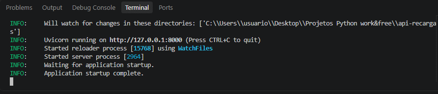
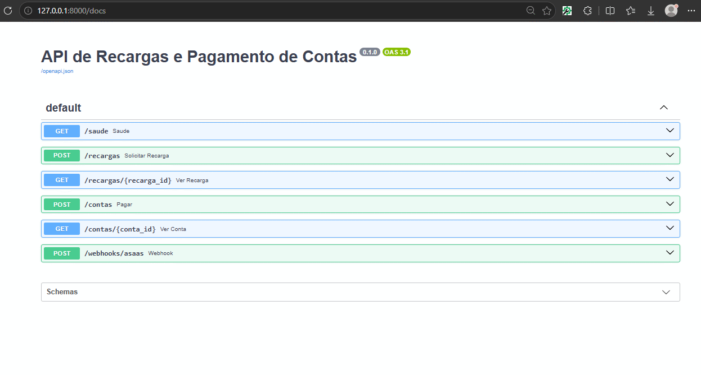
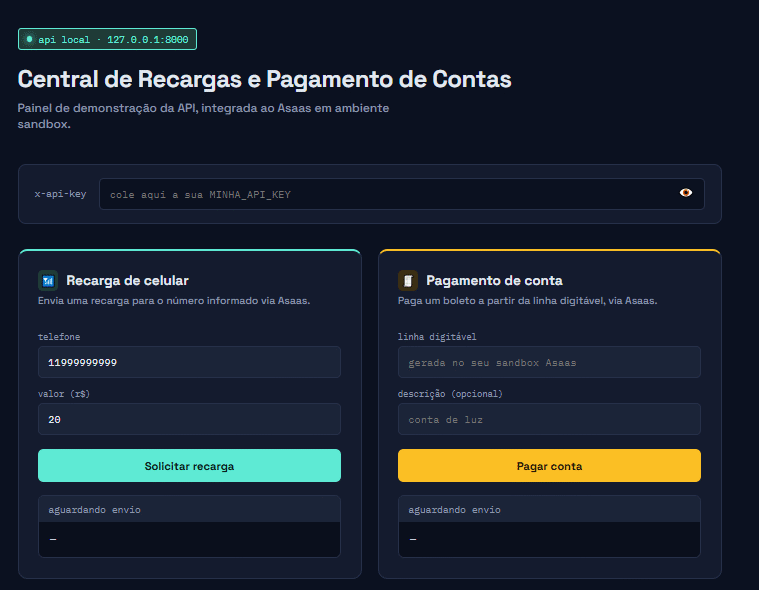
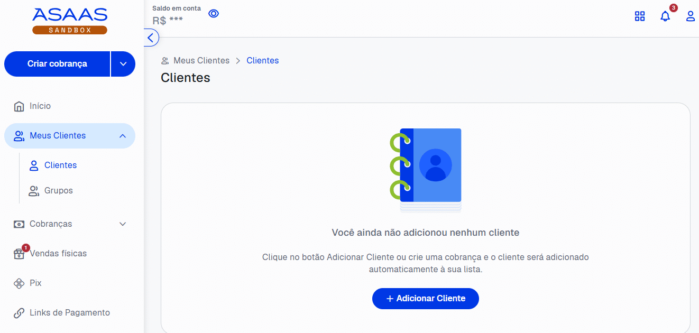
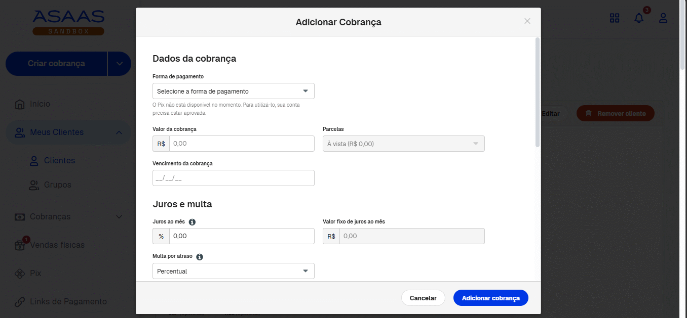
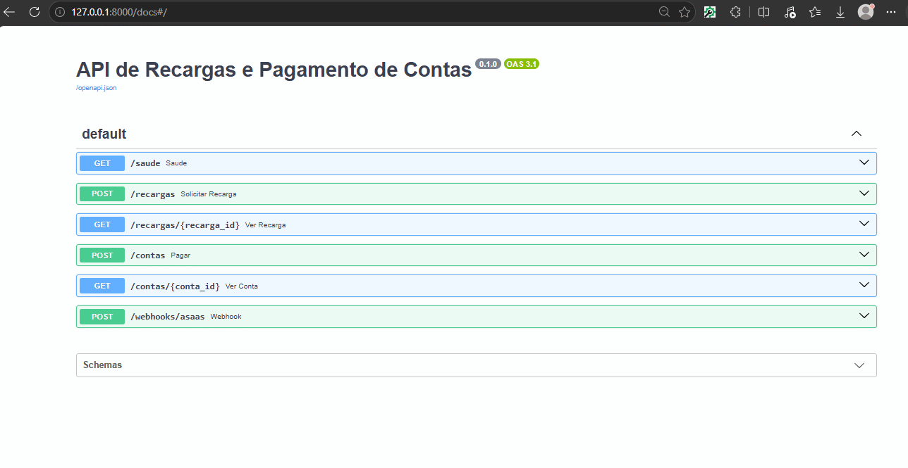
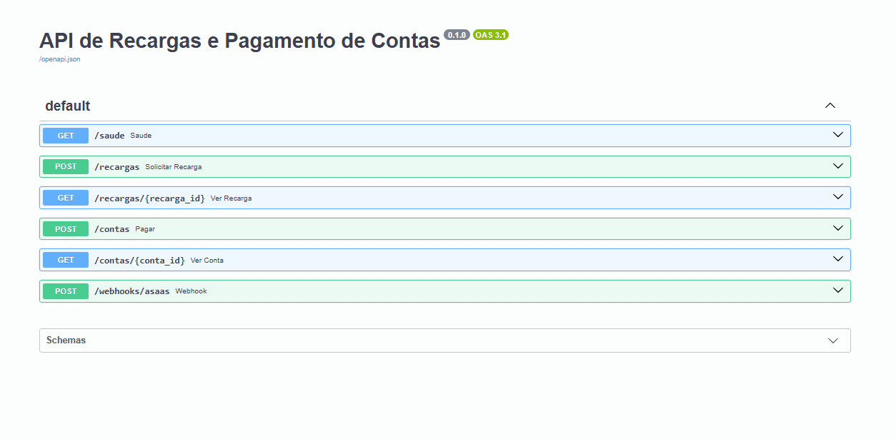
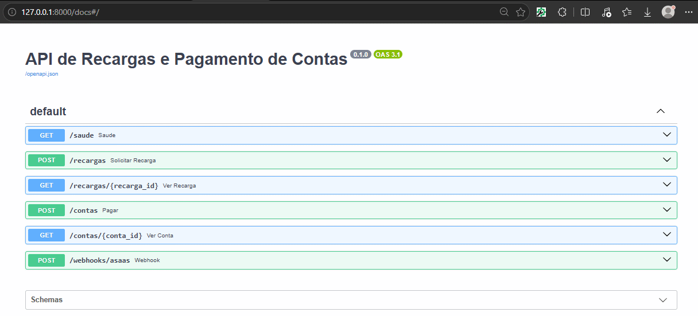
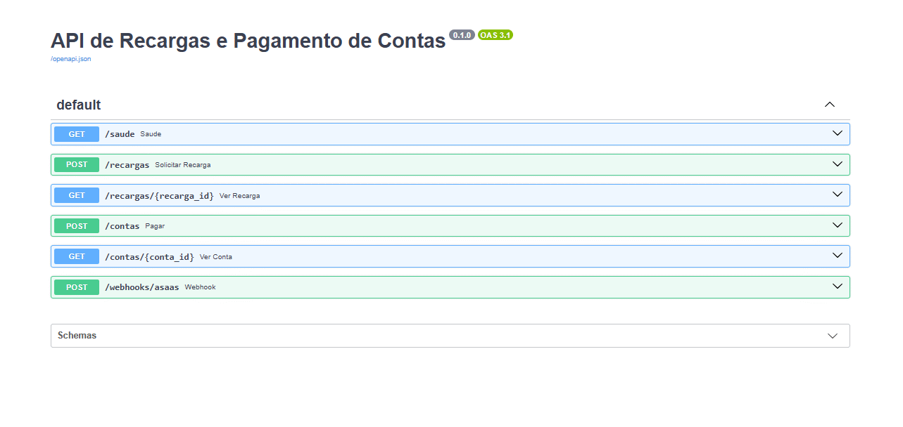
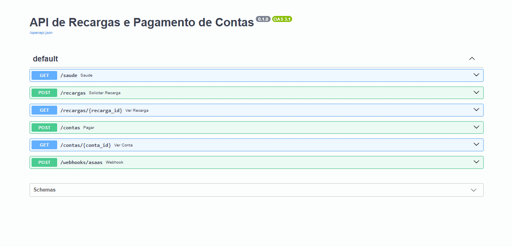

# API de Recarga de Celular e Pagamento de Contas

API própria, construída em Python com FastAPI, que integra com a plataforma **Asaas** para processar recargas de celular e pagamentos de contas (boletos) de forma automatizada.

Projeto de estudo/portfólio, desenvolvido a partir de um pedido real de cliente encontrado em uma plataforma de freelancers, usando o ambiente **sandbox** do Asaas (sem movimentação de dinheiro real).

## Sumário

- [Funcionalidades](#funcionalidades)
- [Tecnologias](#tecnologias)
- [Como rodar o projeto](#como-rodar-o-projeto)
- [Endpoints](#endpoints)
- [Demonstração](#demonstração)

## Funcionalidades

- Solicitar recarga de celular
- Consultar status de uma recarga
- Pagar uma conta via boleto (linha digitável)
- Consultar status de um pagamento
- Receber notificações de mudança de status via webhook
- Autenticação própria por chave de API
- Validação de dados de entrada

## Tecnologias

- Python
- FastAPI
- HTTPX (chamadas HTTP assíncronas)
- Pydantic (validação de dados)
- Asaas API (ambiente sandbox)

## Como rodar o projeto

\`\`\`bash
git clone <https://github.com/noahsvieira/API-de-recargas-e-pagamento-de-contas-com-Asaas>
cd api-recargas
python -m venv .venv
.venv\\Scripts\\activate
pip install -r requirements.txt
\`\`\`

Copie o arquivo de exemplo e preencha com suas próprias chaves:

\`\`\`bash
copy .env.example .env
\`\`\`

Depois, rode:

\`\`\`bash
uvicorn app.main:app --reload
\`\`\`

A documentação interativa fica disponível em `http://127.0.0.1:8000/docs`.

## Endpoints

| Método | Rota | Descrição |
|---|---|---|
| GET | `/saude` | Verifica se a API está no ar |
| POST | `/recargas` | Solicita uma recarga de celular |
| GET | `/recargas/{id}` | Consulta uma recarga |
| POST | `/contas` | Paga uma conta (boleto) |
| GET | `/contas/{id}` | Consulta um pagamento |
| POST | `/webhooks/asaas` | Recebe notificações do Asaas |

## Demonstração

### Entrando na Página

### Backend da API

### Frontend da API

### Criação de Clientes para teste

### Criação de cobrança

### Recarga de celular

### Pagamento de conta

### Consulta de status

### Consulta de status - GET 

### Webhook (recebendo avisos do Asaas)

### Webhook (recebendo avisos do Asaas)

## Licença

Este projeto está sob a licença [MIT](LICENSE)  — sinta-se à vontade para usar como referência de estudo.

## Aviso de segurança

Este projeto usa o ambiente sandbox do Asaas, sem movimentação de dinheiro real. Chaves de API e tokens são carregados via variáveis de ambiente (`.env`, não incluído no repositório) e nunca ficam expostos no código-fonte.
